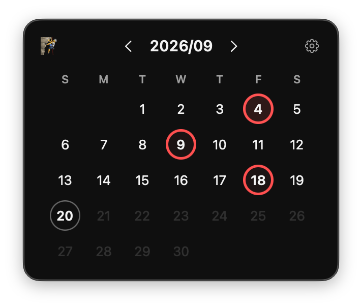

# Roundel

<p align="center">
  
</p>

<p align="center">
  <em>A roundel is a plain filled circle used as an emblem — on flags, aircraft, transit signs.<br>One per day, accumulating into a year.</em>
</p>

A small macOS menu bar app for marking the days something happened. Climbing,
running, writing, not drinking — whatever is worth a ring.

Most trackers want to know how long you went, how you felt, how many days in a
row. Roundel asks one question: did it happen today? Click the day.

## What it does

- **One click a day.** Click a date to ring it, click again to clear it. Days
  that have not arrived cannot be marked.
- **A year at a glance.** The dashboard draws every day of the year as a dot,
  markable in place — the shortest route to a day you missed two months ago.
- **An emoji for what you are tracking**, so the calendar says what it is for.
- **Your data is a file.** Marks live in a plain CSV you can export, edit in a
  spreadsheet, and import back.
- **Nothing leaves your Mac.** No account, no network, no analytics.

## Install

Download the DMG from [Releases](../../releases) and drag Roundel to
Applications. It is signed with a Developer ID and notarized by Apple.

Requires macOS 14 or later. Universal for Apple Silicon and Intel.

Roundel lives in the menu bar and never appears in the Dock. Quit it from the
dashboard.

## Your data

```
~/Library/Containers/com.lileetung.roundel/Data/Library/Application Support/roundel.csv
```

```csv
date,marked_at
2026-09-04,2026-09-04T21:12:07Z
2026-09-09,2026-09-09T19:48:22Z
```

A day is stored as a Gregorian `YYYY-MM-DD`, so crossing time zones never moves
a mark to another day. If the file is ever unreadable it is set aside as
`roundel-unreadable-<timestamp>.csv` rather than overwritten, so nothing is lost
to a bad edit.

## Build

```sh
xcodebuild -project Roundel.xcodeproj -scheme Roundel -destination 'platform=macOS' test
```

To produce a signed, notarized DMG in `dist/`, create a `notarytool` keychain
profile once with `xcrun notarytool store-credentials`, then:

```sh
SIGNING_IDENTITY="Developer ID Application: Your Name (TEAMID)" \
NOTARY_PROFILE="your-profile" \
./scripts/build-dmg.sh
```

Without `SIGNING_IDENTITY` the script builds an ad-hoc signed DMG for local
testing only — do not publish that one.

## License

[MIT](LICENSE)
